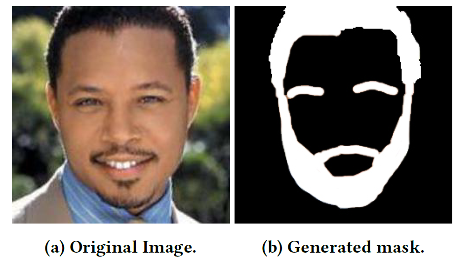
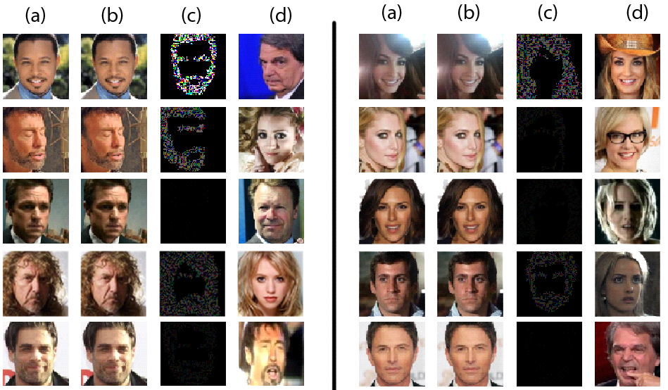

# Adversarial Attack on Facial Recognition System with Predefined Spatial Constraints

From cancer diagnosis to self-driving cars, machine learning is profoundly changing the world. Recent studies show that state-of-the-art machine learning systems are vulnerable to adversarial examples resulting from small-magnitude perturbations added to the input. The broad use of machine learning systems makes it significant to understand the attacks on these systems where physical security and safety are at risk.

In this project, we focus on facial recognition systems, which are widely used in surveillance and access control. We develop and investigate resilient attacks that are physically realizable and inconspicuous, that allow an attacker to impersonate another individual. The investigation focuses on white-box attacks on the face-recognition systems. We develop an attack that will perturb only those facial regions that are normal to be changed for style, pose, fashion, etc. Our model automatically generates perturbations on a specific image for impersonation attack given the predefined spatial constraints. The attack evades the state-of-the-art face-recognition system with 100\% successful impersonation attack considering those spatial constraints. We compare and evaluate the efficacy of our method with state-of-the-art adversarial attacks that do not consider any constraints. Consequently, we propose some suggestions for the possible defenses for these types of spatially constrained attacks.

## Explored ML models:

- ResNet50
- Inception V3
- Convolutional Neural Network (CNN)

## Explored Datasets:

- MCS2018 dataset
- VGG_Face
- ImageNet

## Mask generation for spacial attack on regions with facial hair

## Generated advarsarial image samples

Figure: (a) Original input image, (b) Adversarial image, (c) The perturbation x 100, (d) The target
image. Attack results with spatial constraints.

## Source Code and Data

- [CODE](https://github.com/anik801/AdversarialAttackFacialRecognitionSystem/blob/main/FaceAttackSpatialConstraint.ipynb) is the source code for the task.
- [TEST DATASET](https://github.com/anik801/AdversarialAttackFacialRecognitionSystem/tree/main/Sample%20Data) contains the some sample data to test the code.
- [PRE-TRAINED MODEL](https://github.com/anik801/AdversarialAttackFacialRecognitionSystem/tree/main/Model) contains the pre-trained ResNet50 model.
- [REPORT](https://github.com/anik801/AdversarialAttackFacialRecognitionSystem/tree/main/Face_Attack_Report.pdf) contains detailed project report.

## Instructions to replicate work

This code was written in Python 3.6 and Jupyter Notebook.

## Pre-requisites:

- Python 3.6
- PyTorch
- TorchVision
- Foolbox
- DLib

## Steps:

- Download the MCS 2018 dataset and place the images in “/data/imgs/” directory.
- Download the pretrained ResNet50 model and place in “./resnet50/” directory.

* To generate masks, use the DLib library. Follow the step wise instructions are given in the DLib website. Use manual tuning as required.
* To add mask in the FGSM attack method, modify the FGSM attack file of Foolbox located in device specific installation directory as recommended in the report.
* To execute the spatial constraint attack, run the "FaceAttackSpatialConstraint.ipynb" file after completing the initial setup.
* The provided code was written to run in CPU only. Change in the first code block to make it run on GPU.
* The 3rd code block contains the source and target image. It is written for one pair for better understandability but can be modified for batch execution.
* The rest of the code is self-explanatory and have no need of change.

## Project Team and Contributors

- [Sheik Murad Hassan Anik](https://www.linkedin.com/in/anik801/)
- Md Abdullah Al Maruf
